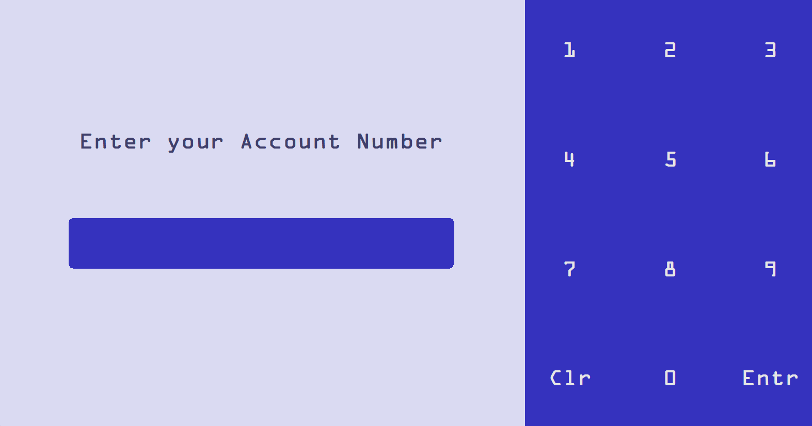
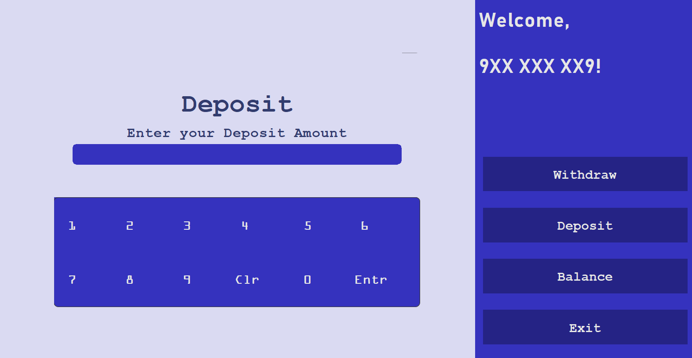
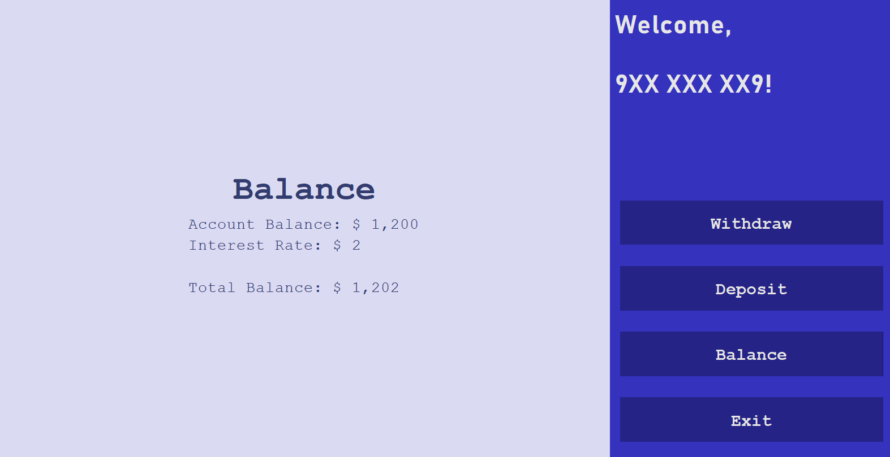

# bank-transaction-sim
 A simple bank transaction simulation in Java

## Features
- Account Number Input
- Withdraw Cash
- Deposit Cash
- Balance Inquiry
- Interest Rate
- Exit

## Goals
- Utilize ArrayList
    > Used as account number and balance storage, basically a 2D ArrayList
- Use the GUI library of Java
    > - Accomplish without the aid of Designers (Netbeans Designer, JForm Designer, etc.)
    > - Provide decent UI/UX
    > - GCash-like color palette
- Provide error feedback
    > - Handle insufficient balance 
    >   - Withdrawal amount is greater than balance
    >   - Resulting balance will be less than $ 500
    > - Handle invalid Account Number
    > - Handle too much deposit amount
    >    - Limit is $ 100,000

## Valid Account Numbers
- 111 111 111
- 222 222 222
- 333 333 333
- 444 444 444
- 555 555 555
- 666 666 666
- 777 777 777
- 888 888 888
- 999 999 999

## Screenshots

Initial Interface

Logged in Interface

Withdraw Interface

Deposit Interface

Balance Interface

## Shortcomings
- Improper display of errors
    > Can still input even while errors are displayed
- Top border of rounded panels show up
    > Shown at screenshot of withdraw and deposit interface
- Usage of many panels as buttons that causes slight delay
